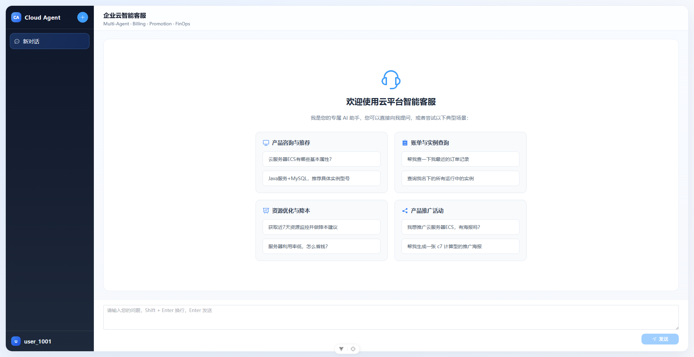
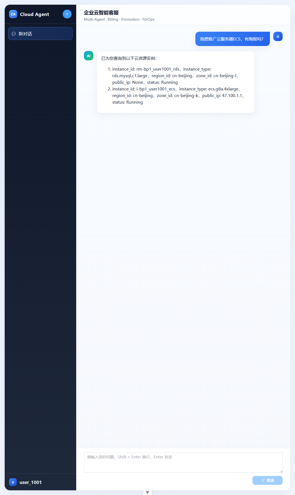
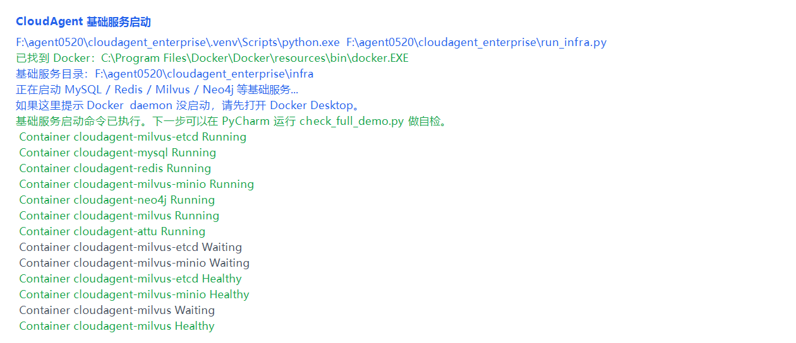
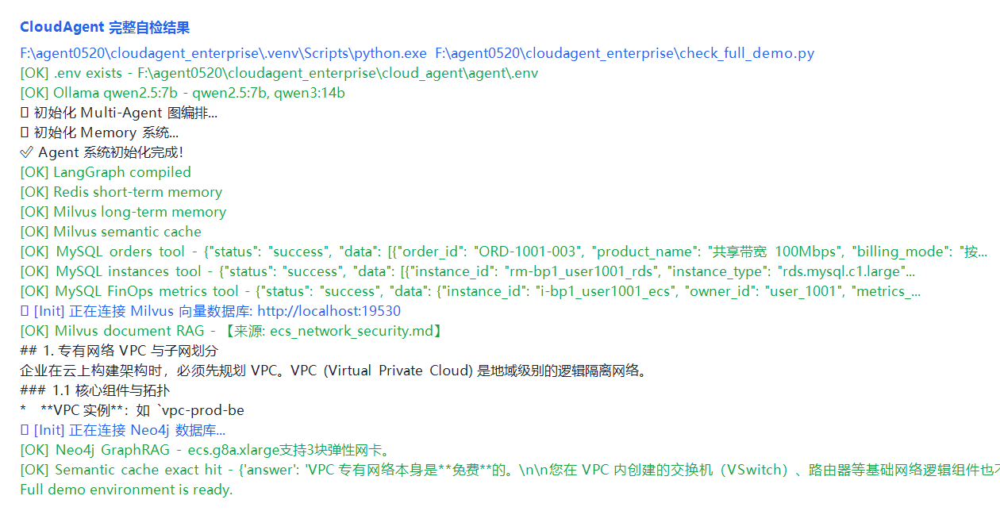

# CloudAgent 云平台客服 Multi-Agent 系统

CloudAgent 是一个面向云平台客服场景的本地 Multi-Agent 演示项目。项目使用 FastAPI + Vue3 构建前后端链路，使用 LangGraph 编排多个专家 Agent，并接入本地 Ollama/Qwen、MCP 风格业务工具、Redis 短期记忆、Milvus RAG/语义缓存和 Neo4j GraphRAG。

> 真实 API Key、虚拟环境、缓存和数据库文件不会提交到 Git。

## 运行截图

### 产品首页



### 业务问答



### 一键启动基础服务



### 完整自检



## 功能概览

- 多 Agent 路由：Orchestrator 根据用户意图路由到 Product、Billing、Recommendation、Promotion、FinOps 等专家 Agent。
- 流式问答：Vue3 前端通过 FastAPI SSE 接收后端流式响应。
- 工具调用：通过业务工具查询订单、实例、监控指标、商品信息和推广物料。
- RAG 与缓存：Milvus 支持产品文档检索、语义缓存和长期记忆。
- GraphRAG：Neo4j 支持规格、产品、地域等结构化知识查询。
- 本地模型：主聊天流程默认使用 Ollama 本地 `qwen2.5:7b`，Embedding 默认使用 DashScope。
- 一键入口：提供 `run_backend.py`、`run_frontend.py` 和 `check_full_demo.py`，方便在 PyCharm 中运行。

## 技术栈

| Layer | Tech |
| --- | --- |
| Frontend | Vue3, Vite, Element Plus, TypeScript |
| Backend | Python, FastAPI, SSE, Pydantic |
| Agent | LangGraph, LangChain |
| Model | Ollama/Qwen, DashScope Embedding |
| Tools | MCP-style cloud platform tools |
| Memory/RAG | Redis, Milvus |
| GraphRAG | Neo4j |
| Infra | Docker Compose, MySQL |

## 项目结构

```text
cloudagent/
  run_backend.py                  # PyCharm-friendly backend launcher
  run_frontend.py                 # PyCharm-friendly frontend launcher
  check_full_demo.py              # Full demo environment smoke check
  infra/docker-compose.yml        # MySQL/Redis/Milvus/Neo4j services

  cloud_agent/
    app/                          # FastAPI web layer
      app_main.py
      router/chat.py
      service/chat_service.py
    agent/                        # LangGraph + Agent + tools
      agents/
      core/workflow/
      core/memory/
      mcp_servers/
      tools/
      database/init_mock_data.sql
      .env.full_demo.example
    front/cloud_agent/            # Vue3 frontend
    mock_data/                    # RAG and GraphRAG demo documents

  docs/
    architecture.md
    runbook.md
    images/
```

## 快速启动

### 1. 准备环境

需要安装：

- Python 3.10 or 3.11
- Node.js 20.19+ or 22.12+
- Docker Desktop
- Ollama

拉取本地模型：

```powershell
ollama pull qwen2.5:7b
```

### 2. 配置环境变量

```powershell
Copy-Item cloud_agent\agent\.env.full_demo.example cloud_agent\agent\.env
```

然后编辑 `cloud_agent\agent\.env`，填入自己的 DashScope API Key：

```text
DASHSCOPE_API_KEY=your_dashscope_api_key
```

### 3. 启动基础服务

```powershell
cd infra
docker compose up -d
cd ..
```

### 4. 安装 Python 依赖

```powershell
python -m venv .venv
.\.venv\Scripts\Activate.ps1
pip install -r cloud_agent\agent\requirements.txt
```

### 5. 安装前端依赖

```powershell
cd cloud_agent\front\cloud_agent
npm install
cd ..\..\..
```

### 6. 初始化演示数据

```powershell
docker exec -i cloudagent-mysql mysql -uroot -pRootPass123! cloud_platform < cloud_agent\agent\database\init_mock_data.sql
.\.venv\Scripts\python.exe cloud_agent\agent\test\milvus_rag.py --ingest --data-dir cloud_agent\mock_data --query "什么是VPC？"
.\.venv\Scripts\python.exe cloud_agent\app\preload_cache.py
.\.venv\Scripts\python.exe cloud_agent\agent\test\import_kg_jsons.py --clear
```

### 7. 自检

```powershell
.\.venv\Scripts\python.exe check_full_demo.py
```

如果最后输出：

```text
Full demo environment is ready.
```

说明本地完整演示环境已经准备好。

### 8. 启动后端和前端

后端：

```powershell
.\.venv\Scripts\python.exe run_backend.py
```

前端：

```powershell
.\.venv\Scripts\python.exe run_frontend.py
```

打开 Vite 输出的本地地址，通常是：

```text
http://localhost:5173/
```

## 推荐演示问题

```text
帮我查一下我最近的订单记录
查询我名下所有运行中的实例
什么是专有网络 VPC？
服务器利用率低，怎么省钱？
我是 Java 接口服务 + MySQL，8核16G够吗？推荐具体实例型号。
ecs.g8a.xlarge 支持多少块弹性网卡？
```

## 文档

- [Architecture](docs/architecture.md)
- [Runbook](docs/runbook.md)

## 当前边界

- 订单、实例、监控、商品和知识库数据均为本地 mock/demo 数据。
- 主聊天模型默认使用本地 Ollama；Embedding、RAG、语义缓存和长期记忆依赖 DashScope Key。
- 本项目当前定位为本地演示项目，不是生产级客服系统。
