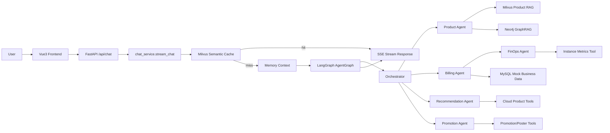

# CloudAgent 架构说明

本文档用于解释 CloudAgent 的整体架构、核心模块和一次真实请求在系统中的流转路径。

## 总体架构



## 核心链路

用户从前端发送问题后，请求进入 FastAPI 的 `/api/chat` 路由：

```text
cloud_agent/front/cloud_agent/src/App.vue
  -> cloud_agent/app/router/chat.py
  -> cloud_agent/app/service/chat_service.py
  -> cloud_agent/agent/core/workflow/graph_manager.py
```

主要流程：

1. 前端发送 `query/user_id/session_id`。
2. FastAPI 返回 `StreamingResponse`，以 SSE 方式流式输出文本。
3. `chat_service.stream_chat()` 先查语义缓存。
4. 未命中缓存时，提取 Redis 短期记忆和 Milvus 长期记忆。
5. 构造 `AgentState`，交给 LangGraph 工作流。
6. Orchestrator 判断用户意图，路由到专家 Agent。
7. 专家 Agent 调用 RAG、GraphRAG 或业务工具。
8. 最终回复保存进短期记忆，并通过 SSE 分块返回前端。

## 模块说明

| 模块 | 文件路径 | 作用 |
| --- | --- | --- |
| FastAPI 入口 | `cloud_agent/app/app_main.py` | 初始化应用、注册 CORS 和 `/api` 路由 |
| Chat 路由 | `cloud_agent/app/router/chat.py` | 接收聊天请求并返回 SSE |
| Chat 服务 | `cloud_agent/app/service/chat_service.py` | 初始化 Agent/Memory，执行缓存、记忆、图编排和流式返回 |
| LangGraph 编排 | `cloud_agent/agent/core/workflow/graph_manager.py` | 定义 Orchestrator 和各专家 Agent 节点之间的边 |
| 全局状态 | `cloud_agent/agent/core/workflow/state.py` | 定义 `AgentState`，传递消息、用户、记忆和元数据 |
| 路由 Agent | `cloud_agent/agent/agents/orchestrator.py` | 根据规则和 LLM 判断问题类型 |
| 业务 Agent | `cloud_agent/agent/agents/*.py` | 分别处理产品、账单、推荐、推广和 FinOps |
| MCP 工具 | `cloud_agent/agent/mcp_servers/cloud_platform_server.py` | 封装订单、实例、监控、商品等业务查询 |
| RAG 工具 | `cloud_agent/agent/tools/vector_tool.py` | 查询 Milvus 产品文档 |
| GraphRAG 工具 | `cloud_agent/agent/tools/graph_tool.py` | 查询 Neo4j 知识图谱 |
| Memory | `cloud_agent/agent/core/memory/*.py` | 管理 Redis 短期记忆和 Milvus 长期记忆 |
| 语义缓存 | `cloud_agent/app/infra/cache.py` | 对高频问答做语义命中 |

## Agent 路由逻辑

Orchestrator 的路由目标包括：

- `product_agent`：云产品介绍、概念解释、操作指南、RAG/GraphRAG 查询。
- `billing_agent`：用户订单、实例、账单、资源状态查询。
- `recommendation_agent`：根据业务场景做云资源选型推荐。
- `promotion_agent`：推广链接、返佣、海报等营销类需求。
- `finops_agent`：资源利用率、降本增效、成本优化建议。

其中 FinOps 是一个跨 Agent 流程：

```text
用户提出降本需求
  -> Orchestrator 标记 is_finops_workflow
  -> Billing Agent 先查询实例和监控数据
  -> FinOps Agent 基于实例数据给出优化建议
```

## 记忆与缓存

当前系统包含三类上下文增强能力：

- Redis 短期记忆：保存同一用户/会话的近期对话。
- Milvus 长期记忆：保存用户偏好或背景信息，按 query 检索相关内容。
- Milvus 语义缓存：对常见问题直接返回缓存答案，减少重复推理。

这些能力在 `cloud_agent/app/service/chat_service.py` 中被统一接入。

## 数据来源

本项目用于本地演示，数据主要来自：

- `cloud_agent/agent/database/init_mock_data.sql`：MySQL mock 订单、实例、监控数据。
- `cloud_agent/mock_data/*.md`：Milvus RAG 文档。
- `cloud_agent/mock_data/*.json`：Neo4j GraphRAG 结构化数据。

这意味着项目适合作为本地演示和技术学习项目，但不应描述为真实生产业务系统。
