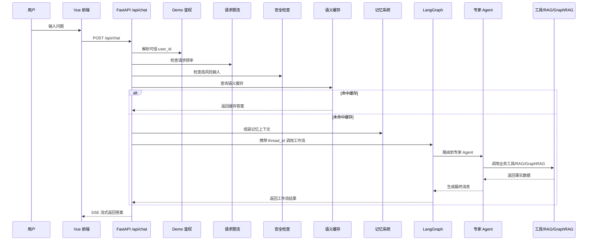

# CloudAgent Enterprise 小白教学版

这份文档面向“有 Python/深度学习基础，但不熟悉前后端、LangGraph、RAG、部署和 AI 应用工程”的学习者。目标不是背概念，而是能讲清楚：

```text
用户从网页上问一句话，到系统返回答案，中间到底发生了什么？
```

## 0. 先建立一个朴素理解

你可以把 CloudAgent Enterprise 想象成一个云平台客服中心：

```text
客户在网页聊天框里提问。
后端先确认用户身份、请求频率和输入是否危险。
系统先查有没有语义缓存答案。
如果没有缓存，就取出历史记忆，把请求送进 LangGraph。
总调度员 Orchestrator 判断问题类型。
系统把问题交给对应专家 Agent。
专家 Agent 调用业务工具、RAG 或 GraphRAG 查事实。
后端把答案一点点流式返回给网页。
日志、指标、trace_id、测试和 eval 帮助系统可维护。
```

和原始玩具 Demo 相比，新版最重要的变化不是“多了几个 Agent”，而是补了企业项目会关心的边界：

```text
可观测性、稳定错误、安全拦截、demo 鉴权边界、checkpoint、部署骨架、CI 门禁、限流、超时、简历边界文档
```

## 1. 整个系统的六层结构

| 层级 | 作用 | 关键文件 |
| --- | --- | --- |
| 前端层 | 用户聊天界面和流式展示 | `cloud_agent/front/cloud_agent/src/App.vue` |
| API 后端层 | 接收聊天请求、流式返回答案 | `cloud_agent/app/router/chat.py`, `cloud_agent/app/service/chat_service.py` |
| 可信边界层 | 鉴权、限流、安全检查、错误、日志、指标 | `cloud_agent/app/infra/*` |
| Agent 编排层 | LangGraph 状态图和 checkpoint | `cloud_agent/agent/core/workflow/*` |
| 专家 Agent 层 | Billing、Product、Recommendation、Promotion、FinOps | `cloud_agent/agent/agents/*` |
| 数据和工具层 | MCP 工具、MySQL、Redis、Milvus、Neo4j | `cloud_agent/agent/mcp_servers/*`, `cloud_agent/agent/tools/*` |

一句话记忆：

```text
前端负责看得见，后端负责接请求，可信边界负责挡风险，LangGraph 负责调度，Agent 负责业务，工具和数据库负责事实。
```

## 2. 一次真实请求怎么走



## 3. 原型版和企业版有什么区别

### 原型版

原来的项目主要证明：

- 前端能聊天。
- 后端能接请求。
- LangGraph 多 Agent 能跑。
- 工具、RAG、记忆能串起来。
- 本地自检能跑通。

这已经是一个不错的学习 Demo，但还不像企业项目。

### 企业版

现在企业副本新增了：

- 请求级 trace_id。
- 结构化 JSON 日志。
- `/api/health`、`/api/ready`、`/api/metrics`。
- pytest、golden eval、GitHub Actions CI。
- 稳定 SSE 错误响应。
- 规则版安全输入检查。
- demo-token 鉴权边界。
- SQLite LangGraph checkpoint。
- 结构化日志 PII/secret 脱敏。
- 后端 Dockerfile 和 compose override。
- Docker Compose 配置发布门禁。
- per-user 请求限流。
- 工作流超时处理。
- 简历/面试交付文档。

所以现在更合适的定位是：

```text
企业级改造方向的内部 AI 助手 MVP
```

而不是：

```text
简单聊天机器人 Demo
```

## 4. 后端入口层

关键文件：

```text
run_backend.py
cloud_agent/app/app_main.py
cloud_agent/app/router/chat.py
cloud_agent/app/service/chat_service.py
```

`run_backend.py` 是 PyCharm 友好的后端启动器。它会设置工作目录和 Python import 路径，然后在 5000 端口启动 Uvicorn。

`app_main.py` 创建 FastAPI 应用，注册路由，并在启动时初始化 Agent 系统。

`router/chat.py` 是 HTTP 入口。它现在不再信任请求体里的 `user_id`，而是从 demo token 解析后端可信用户身份，并在进入工作流前做限流。

`service/chat_service.py` 是主业务链路。它负责安全检查、语义缓存、记忆上下文、LangGraph 调用、SSE 分块输出、指标记录和结构化日志。

## 5. 可信边界层

关键文件：

```text
cloud_agent/app/infra/auth.py
cloud_agent/app/infra/rate_limiter.py
cloud_agent/app/infra/security_guard.py
cloud_agent/app/infra/error_response.py
cloud_agent/app/infra/structured_logging.py
cloud_agent/app/infra/metrics.py
cloud_agent/app/infra/request_context.py
```

小白理解：

```text
可信边界层决定后端愿意相信什么、执行什么、记录什么、返回什么。
```

具体分工：

- `auth.py`：把 demo bearer token 映射成后端可信 user_id。
- `rate_limiter.py`：防止同一个用户短时间内刷太多请求。
- `security_guard.py`：在进入缓存、记忆和 Agent 前，拦截明显的跨用户查询、Prompt Injection 和密钥窃取请求。
- `error_response.py`：把内部异常转换成安全的前端错误码。
- `structured_logging.py`：输出 JSON 日志，并对常见邮箱、手机号、token、API key 做脱敏。
- `metrics.py`：记录请求数、失败数、缓存命中、安全拦截和平均延迟。
- `request_context.py`：给每个请求生成 trace_id。

## 6. LangGraph 工作流层

关键文件：

```text
cloud_agent/agent/core/workflow/state.py
cloud_agent/agent/core/workflow/graph_manager.py
cloud_agent/agent/core/workflow/checkpointing.py
```

`AgentState` 可以理解为多个 Agent 之间传递的公共背包，里面包括：

```text
messages
user_id
session_id
memory_context
next_agent
metadata
```

`graph_manager.py` 构建工作流：

```text
START -> Orchestrator -> 专家 Agent -> END
```

`checkpointing.py` 用 SQLite 保存本地 LangGraph checkpoint。它适合本地演示和单机持久化，但真正生产环境后续应该换成 Postgres 或托管型 checkpointer。

## 7. 专家 Agent 层

| Agent | 主要职责 |
| --- | --- |
| BillingAgent | 订单、实例、用户资产 |
| ProductAgent | 产品文档、RAG、GraphRAG |
| RecommendationAgent | 实例/产品选型推荐 |
| PromotionAgent | 推广物料和海报相关流程 |
| FinOpsAgent | 基于实例和监控数据做降本建议 |

为什么要多 Agent？

```text
因为云平台问题类型差异很大。订单查询、产品咨询、选型推荐、推广和降本分析需要不同上下文和工具。如果全塞进一个大 Prompt，会越来越混乱。多 Agent 能按职责拆分，让每个专家只处理自己的垂直场景。
```

## 8. 工具、RAG、GraphRAG、记忆

MCP-style 工具：

```text
cloud_agent/agent/mcp_servers/cloud_platform_server.py
```

RAG：

```text
cloud_agent/agent/tools/vector_tool.py
cloud_agent/mock_data/*.md
```

GraphRAG：

```text
cloud_agent/agent/tools/graph_tool.py
cloud_agent/mock_data/*.json
```

记忆：

```text
cloud_agent/agent/core/memory/short_term.py
cloud_agent/agent/core/memory/long_term.py
cloud_agent/agent/core/memory/memory_manager.py
```

简单区分：

```text
文档解释 -> Milvus RAG
结构化关系查询 -> Neo4j GraphRAG
最近对话 -> Redis 短期记忆
用户偏好 -> Milvus 长期记忆
```

## 9. 运维和验证

企业版有固定验证命令：

```powershell
.\.venv\Scripts\python.exe -m pytest tests -q
.\.venv\Scripts\python.exe cloud_agent\evals\run_eval.py --mode static
.\.venv\Scripts\python.exe cloud_agent\evals\run_eval.py --mode route
docker compose -f infra\docker-compose.yml -f infra\docker-compose.enterprise.yml config --quiet
```

这些命令不能证明它已经是完整生产系统，但能证明项目有可重复的质量门禁。

## 10. 客户演示话术

可以这样介绍：

```text
这是一个面向云平台客服/运维场景的内部 AI 助手 MVP。用户在浏览器里提问后，后端会先解析可信 demo 身份，做请求限流和输入安全检查，然后查询语义缓存。未命中缓存时，系统会注入记忆上下文，进入 LangGraph 多 Agent 工作流。Orchestrator 根据意图把请求路由到对应专家 Agent，专家 Agent 再调用业务工具、Milvus RAG 或 Neo4j GraphRAG 获取事实数据。最终答案通过 SSE 流式返回前端，同时系统记录 trace 日志、请求指标、稳定错误和 eval/CI 结果，方便维护和演示。
```

## 11. 推荐学习顺序

建议按这个顺序读代码：

1. `docs/project_handoff.md`
2. `cloud_agent/app/router/chat.py`
3. `cloud_agent/app/service/chat_service.py`
4. `cloud_agent/app/infra/security_guard.py`
5. `cloud_agent/agent/core/workflow/graph_manager.py`
6. `cloud_agent/agent/agents/orchestrator.py`
7. `cloud_agent/agent/agents/billing_agent.py`
8. `cloud_agent/agent/agents/product_agent.py`
9. `cloud_agent/agent/tools/vector_tool.py`
10. `cloud_agent/agent/tools/graph_tool.py`

## 12. 面试边界

可以说：

```text
这是一个企业级改造方向的内部试点/MVP，具备本地可复现演示、CI/Eval、可观测性骨架、安全边界和部署就绪能力。
```

不要说：

```text
这是完整公网 SaaS 生产平台，已经具备真实 OAuth、分布式 tracing、Postgres checkpoint、自动扩缩容、TLS 和完整多租户隔离。
```
