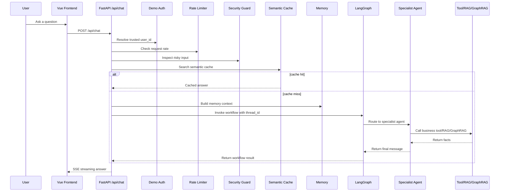

# CloudAgent Enterprise Teaching Guide

This guide teaches the refactored enterprise version from a beginner-friendly
view. The target reader knows some Python and deep learning, but is less
familiar with frontend/backend, LangGraph, RAG, deployment, and AI application
engineering.

## 0. One Plain Explanation

Imagine CloudAgent Enterprise as a cloud-service support desk:

```text
Customer asks a question in a web chat.
The backend checks identity, rate limit, and risky input.
The system checks whether the question has a cached answer.
If not cached, it brings in memory and sends the request into LangGraph.
The orchestrator decides which specialist agent should handle it.
The specialist agent calls business tools, RAG, or GraphRAG.
The backend streams the final answer back to the browser.
Logs, metrics, trace IDs, and eval tests make the system easier to operate.
```

The important upgrade from the original prototype is not "more agents". The
important upgrade is that the system now has enterprise-oriented boundaries:
observability, stable errors, security checks, demo auth boundary, checkpoint
persistence, deployment scaffolding, CI gates, rate limiting, and documented
claims.

## 1. Six Layers Of The System

| Layer | Purpose | Key Files |
| --- | --- | --- |
| Frontend | User chat UI and streaming display | `cloud_agent/front/cloud_agent/src/App.vue` |
| API backend | Receives chat requests and streams responses | `cloud_agent/app/router/chat.py`, `cloud_agent/app/service/chat_service.py` |
| Trust boundary | Auth, rate limit, security guard, errors, logs | `cloud_agent/app/infra/*` |
| Agent workflow | LangGraph state machine and checkpointing | `cloud_agent/agent/core/workflow/*` |
| Specialist agents | Billing, Product, Recommendation, Promotion, FinOps | `cloud_agent/agent/agents/*` |
| Data/tools | MCP tools, MySQL, Redis, Milvus, Neo4j | `cloud_agent/agent/mcp_servers/*`, `cloud_agent/agent/tools/*` |

## 2. Request Path



## 3. What Changed Compared With The Toy Prototype

### Before

The original project was a runnable demo:

- Frontend chat.
- FastAPI endpoint.
- LangGraph agents.
- RAG/tools/memory.
- Local smoke check.

### Now

The enterprise copy adds:

- Request trace IDs.
- Structured JSON logs.
- `/api/health`, `/api/ready`, `/api/metrics`.
- CI with pytest and eval checks.
- Stable SSE error payloads.
- Rule-based security guard.
- Demo-token auth boundary.
- SQLite LangGraph checkpoint persistence.
- Structured log PII/secret redaction.
- Backend Dockerfile and compose override.
- Compose config release gate.
- Per-user rate limiting.
- Workflow timeout handling.
- Resume/interview handoff document.

This is why the project is now better described as:

```text
enterprise-oriented internal AI assistant MVP
```

not:

```text
simple chatbot demo
```

## 4. The Backend Entry Point

Main files:

```text
run_backend.py
cloud_agent/app/app_main.py
cloud_agent/app/router/chat.py
cloud_agent/app/service/chat_service.py
```

`run_backend.py` is a PyCharm-friendly launcher. It fixes working directory and
Python import paths, then starts Uvicorn on port `5000`.

`app_main.py` creates the FastAPI app, registers routers, and initializes the
Agent system during app startup.

`router/chat.py` is the HTTP boundary. It no longer trusts `user_id` from the
request body. It resolves user identity from demo token headers and applies
rate limiting before entering the streaming workflow.

`service/chat_service.py` is the main orchestration bridge. It performs security
inspection, cache lookup, memory context extraction, LangGraph invocation,
streaming chunk output, metrics, and structured logging.

## 5. The Trust Boundary

Key files:

```text
cloud_agent/app/infra/auth.py
cloud_agent/app/infra/rate_limiter.py
cloud_agent/app/infra/security_guard.py
cloud_agent/app/infra/error_response.py
cloud_agent/app/infra/structured_logging.py
cloud_agent/app/infra/metrics.py
cloud_agent/app/infra/request_context.py
```

Beginner mental model:

```text
The trust boundary decides what the backend is willing to accept, log, run, and
return.
```

Important points:

- `auth.py`: maps demo bearer tokens to trusted backend user IDs.
- `rate_limiter.py`: prevents one user from spamming requests in a short window.
- `security_guard.py`: blocks obvious cross-user access, prompt injection, and
  secret-exfiltration attempts before cache/memory/Agent execution.
- `error_response.py`: converts internal exceptions into safe client-facing
  error codes.
- `structured_logging.py`: emits JSON logs and redacts common PII/secrets.
- `metrics.py`: records in-process request, cache, security, and latency
  counters.
- `request_context.py`: gives each request a trace ID.

## 6. LangGraph Workflow

Key files:

```text
cloud_agent/agent/core/workflow/state.py
cloud_agent/agent/core/workflow/graph_manager.py
cloud_agent/agent/core/workflow/checkpointing.py
```

`AgentState` is the shared backpack passed between nodes:

```text
messages
user_id
session_id
memory_context
next_agent
metadata
```

`graph_manager.py` builds the workflow graph:

```text
START -> Orchestrator -> specialist agent -> END
```

`checkpointing.py` adds SQLite checkpoint persistence for local sessions. This
is good for demo and local persistence, but the production version should move
to Postgres or a managed checkpointer.

## 7. Specialist Agents

| Agent | Main Responsibility |
| --- | --- |
| BillingAgent | Orders, instances, user assets |
| ProductAgent | Product docs, RAG, GraphRAG |
| RecommendationAgent | Instance/product recommendation |
| PromotionAgent | Promotion materials and poster-related workflow |
| FinOpsAgent | Cost optimization based on instance and monitoring data |

The orchestrator routes the request based on intent. This is better than one
giant prompt because each agent has a narrower responsibility.

## 8. Tools, RAG, GraphRAG, Memory

MCP-style tools:

```text
cloud_agent/agent/mcp_servers/cloud_platform_server.py
```

RAG:

```text
cloud_agent/agent/tools/vector_tool.py
cloud_agent/mock_data/*.md
```

GraphRAG:

```text
cloud_agent/agent/tools/graph_tool.py
cloud_agent/mock_data/*.json
```

Memory:

```text
cloud_agent/agent/core/memory/short_term.py
cloud_agent/agent/core/memory/long_term.py
cloud_agent/agent/core/memory/memory_manager.py
```

Simple rule:

```text
Document explanation -> Milvus RAG
Structured relationship query -> Neo4j GraphRAG
Recent conversation -> Redis short-term memory
User preference -> Milvus long-term memory
```

## 9. Operations And Verification

The enterprise version has verification commands:

```powershell
.\.venv\Scripts\python.exe -m pytest tests -q
.\.venv\Scripts\python.exe cloud_agent\evals\run_eval.py --mode static
.\.venv\Scripts\python.exe cloud_agent\evals\run_eval.py --mode route
docker compose -f infra\docker-compose.yml -f infra\docker-compose.enterprise.yml config --quiet
```

These do not prove full production readiness, but they prove the project has a
repeatable quality gate.

## 10. Customer Demo Script

Use this explanation when presenting:

```text
This is an internal cloud-service AI assistant MVP. A user asks a question in
the browser. The backend first resolves a trusted demo identity, applies
rate-limit and input-security checks, then searches semantic cache. If no cache
answer is found, it injects memory context and invokes a LangGraph multi-agent
workflow. The orchestrator routes the request to the right specialist agent,
which calls business tools, Milvus RAG, or Neo4j GraphRAG. The answer is streamed
back to the frontend, while trace logs, metrics, stable errors, evals, and CI
help make the system maintainable.
```

## 11. What To Study First

Read in this order:

1. `docs/project_handoff.md`
2. `cloud_agent/app/router/chat.py`
3. `cloud_agent/app/service/chat_service.py`
4. `cloud_agent/app/infra/security_guard.py`
5. `cloud_agent/agent/core/workflow/graph_manager.py`
6. `cloud_agent/agent/agents/orchestrator.py`
7. `cloud_agent/agent/agents/billing_agent.py`
8. `cloud_agent/agent/agents/product_agent.py`
9. `cloud_agent/agent/tools/vector_tool.py`
10. `cloud_agent/agent/tools/graph_tool.py`

## 12. Interview Boundary

Say:

```text
This is an enterprise-oriented internal pilot/MVP with local reproducible demo,
CI/eval checks, observability scaffolding, security boundaries, and deployment
readiness.
```

Do not say:

```text
It is a full production SaaS platform with real OAuth, distributed tracing,
Postgres checkpointing, autoscaling, TLS, and multi-tenant isolation.
```
