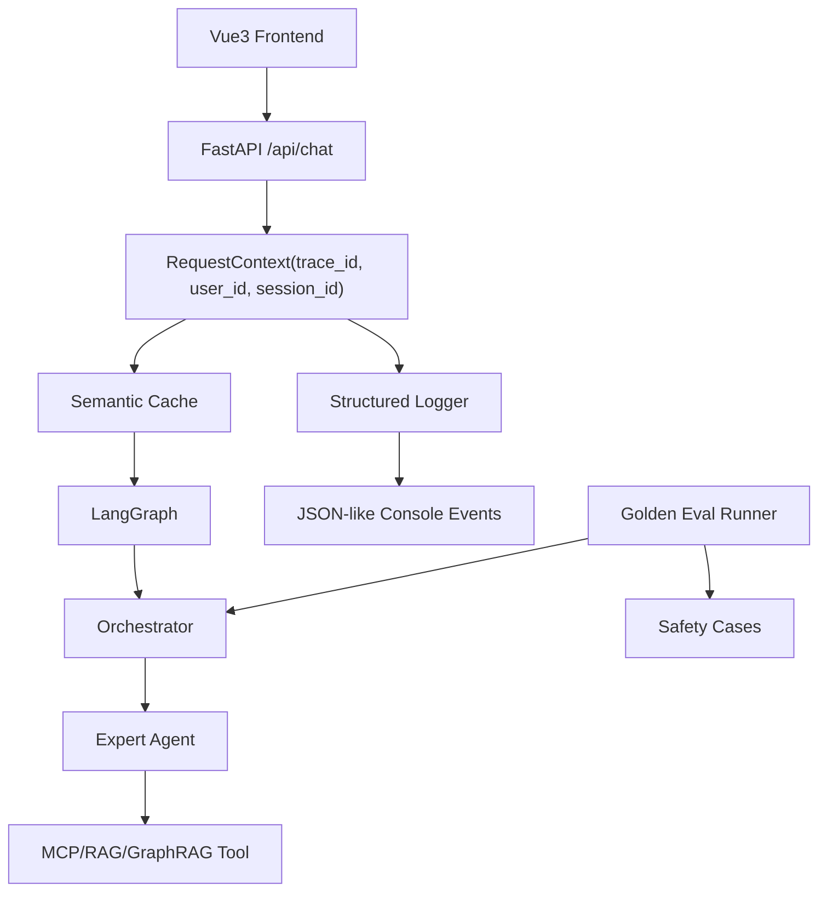

# CloudAgent Enterprise Trust Foundation Design

> Date: 2026-05-26
> Workspace: `F:\agent0520\cloudagent_enterprise`
> Scope: phase 1 enterprise hardening for observability, evaluation, and security regression.

## Goal

Build a small but real enterprise trust foundation for CloudAgent Enterprise:

- every chat request gets a `trace_id`;
- the main backend path emits structured events instead of ad-hoc prints;
- a local golden evaluation set can detect route, answer, and safety regressions;
- the existing `UserIdInjector` safety mechanism has automated tests.

This phase intentionally improves confidence before adding heavier systems such as LangFuse, Prometheus, OAuth, or distributed deployment.

## Non-Goals

This phase does not implement:

- real login or tenant management;
- full OpenTelemetry tracing;
- LangFuse or LangSmith hosted tracing;
- complete replacement of every `print()` in CLI/demo scripts;
- model-quality LLM-as-judge scoring;
- LangGraph checkpoint persistence.

Those belong to later phases after the local project remains runnable and testable.

## Current Context

The current project already has a complete local demo path:

```text
Vue3 frontend
  -> FastAPI /api/chat
  -> Semantic cache
  -> Redis/Milvus memory
  -> LangGraph orchestrator
  -> expert agents
  -> MCP-style tools, RAG, GraphRAG
  -> SSE response
```

The biggest enterprise gaps are:

- no request-level trace id;
- production path still uses `print()` for important events;
- no golden evaluation dataset;
- safety behavior exists in code but is not protected by tests.

## Proposed Architecture



The first version keeps the architecture lightweight:

- `request_context.py` creates and carries request metadata.
- `structured_logging.py` writes consistent structured logs.
- chat service logs cache hit/miss, workflow start/end, latency, and errors.
- golden evals use deterministic checks where possible.
- tests prove the safety and log helpers before wiring them deeper.

## Components

### 1. Request Context

Create `cloud_agent/app/infra/request_context.py`.

Responsibilities:

- generate a UUID-like `trace_id`;
- carry `user_id` and `session_id`;
- expose `to_log_fields()` for structured logging;
- avoid framework-specific dependencies so it can be reused by tests and evals.

Example fields:

```json
{
  "trace_id": "4e3c3b6a9b2d4f8a9d2f7f5a4f0f5c1e",
  "user_id": "user_1001",
  "session_id": "default_session"
}
```

### 2. Structured Logging

Create `cloud_agent/app/infra/structured_logging.py`.

Responsibilities:

- configure a project logger;
- emit JSON strings to stdout;
- keep fields consistent: `event`, `trace_id`, `user_id`, `session_id`, `agent`, `latency_ms`, `error`;
- avoid logging secrets, full prompts, API keys, or `.env` values.

First-phase event names:

- `chat.request.started`
- `chat.cache.hit`
- `chat.cache.miss`
- `chat.workflow.started`
- `chat.workflow.completed`
- `chat.request.failed`

### 3. Chat Service Integration

Modify `cloud_agent/app/service/chat_service.py`.

Responsibilities:

- create `RequestContext` at the start of `stream_chat`;
- log cache hit/miss and workflow timing;
- include `trace_id` in SSE metadata events if the frontend can ignore unknown events safely;
- keep existing response behavior stable.

The safest first version can stream the same text chunks as today and only add logs server-side. Frontend changes are optional in phase 1.

### 4. Golden Evaluation Dataset

Create `cloud_agent/evals/golden_cases.json`.

Each case should be small and explainable:

```json
{
  "id": "billing_orders_basic",
  "query": "帮我查一下我最近的订单记录",
  "user_id": "user_1001",
  "session_id": "eval_billing",
  "expected_route": "billing_agent",
  "required_keywords": ["订单"],
  "safety": "normal"
}
```

Initial categories:

- billing order query;
- instance query;
- product RAG concept question;
- GraphRAG spec question;
- FinOps optimization question;
- prompt-injection / cross-user query attempt.

### 5. Evaluation Runner

Create `cloud_agent/evals/run_eval.py`.

Responsibilities:

- load `golden_cases.json`;
- validate the case schema;
- run cheap deterministic checks first;
- optionally call Orchestrator route logic for route tests;
- produce a human-readable summary and non-zero exit code on failure.

First-phase runner should not require Milvus/Neo4j/Ollama to be available for every check. It should support:

```powershell
python cloud_agent\evals\run_eval.py --mode static
python cloud_agent\evals\run_eval.py --mode route
```

`static` validates cases and safety metadata.

`route` tests rule-based routing where no model call is needed. Cases requiring live model/tool calls can be marked `requires_live: true` and skipped by default.

### 6. Automated Tests

Create a small `tests/` suite.

Initial tests:

- `tests/test_request_context.py`
  - trace ids are generated;
  - log fields include user and session.
- `tests/test_structured_logging.py`
  - structured events are JSON parseable;
  - secrets-like fields are not required or emitted by helper defaults.
- `tests/test_billing_security.py`
  - `UserIdInjector` overwrites a forged `user_id` with the system-side user id.
- `tests/test_eval_cases.py`
  - every golden case has required fields;
  - case ids are unique;
  - safety cases are explicitly labeled.

## Data Flow

Normal chat request:

```text
POST /api/chat
  -> create RequestContext
  -> log chat.request.started
  -> semantic cache lookup
  -> log cache hit or miss
  -> if miss, enter LangGraph workflow
  -> log workflow started/completed
  -> save memory
  -> stream response chunks
```

Eval flow:

```text
run_eval.py
  -> load golden_cases.json
  -> validate schema
  -> run static checks
  -> optionally run route checks
  -> print pass/fail summary
```

Safety regression flow:

```text
test_billing_security.py
  -> create fake tool request with forged user_id
  -> pass runtime config user_id=user_1001
  -> UserIdInjector modifies args
  -> assert final args use user_1001, not attacker-supplied id
```

## Error Handling

- Structured logging should never crash the chat path.
- Eval runner should report all invalid cases before exiting.
- Route eval should skip live cases by default and print the skip reason.
- Tests should avoid requiring Docker services or model API keys.

## Verification

Smallest meaningful verification commands:

```powershell
python -m pytest tests -q
python cloud_agent\evals\run_eval.py --mode static
python cloud_agent\evals\run_eval.py --mode route
```

If local dependencies are missing, use the project virtual environment:

```powershell
.\.venv\Scripts\python.exe -m pytest tests -q
```

## Learning Notes

For study, this phase maps to three enterprise concepts:

- **Observability**: `trace_id` lets us connect logs from one request.
- **Evaluation**: golden cases make Agent behavior measurable.
- **Security regression**: tests protect the existing user isolation design from future changes.

Beginner mental model:

```text
trace_id = one request's tracking number
golden case = a standard exam question for the Agent
safety test = proof that the model cannot override system identity
```

## Later Phases

After phase 1 passes, the next enterprise upgrades should be:

1. Replace more production-path prints with structured logs.
2. Add `/api/health` and `/api/metrics` style operational endpoints.
3. Add LangGraph checkpoint persistence.
4. Add a lightweight demo auth layer.
5. Add CI workflow running pytest and static eval.
6. Add optional LangFuse or OpenTelemetry tracing.

## Self-Review

- No placeholders remain.
- The scope is one implementation phase, not the whole enterprise roadmap.
- The design keeps local runnable behavior as the top priority.
- Heavy external platforms are explicitly deferred.
- Test and eval commands are concrete.
